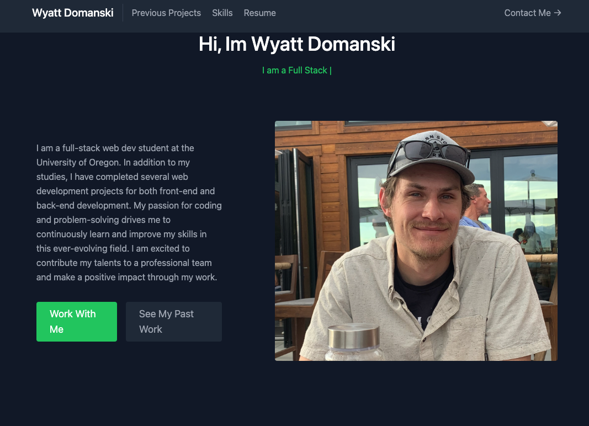

# React Portfolio

# Description

Simple Portfolio built using the React framework, A Portfolio I will use to practice my skills as I build and manage this app while I continue through the coding bootcamp.

# Screenshot

# Credits

- https://react-icons.github.io/react-icons/icons?name=go
- @camwiegert/typical
- https://www.freecodecamp.org/
- Tailwindcss/react

# Link

https://wyamet.github.io/PortfolioDojo/

# License

\*See file
